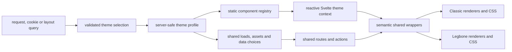

# Theme extension roadmap

This roadmap is part of the current two-layout PR. Classic and Legbone already
share routes, data, permissions and actions; this work makes that boundary
explicit before the PR is merged into `main`. A future layout should be added by
registering a profile, a static shell and the presentation variants it actually
needs, without teaching every route about another theme ID.

The roadmap deliberately stops short of publishing a third layout. A test-only
contract fixture proves that a third registration can resolve without silently
falling back to Legbone or changing a shared route.

## How to use this document

- Check a box only after the implementation and its validation are complete.
- Add the commit, command and evidence to the progress log for every completed
  phase.
- Keep one coherent phase or page family per commit while this PR is open.
- Do not add a capability only for a hypothetical future theme. A capability
  must be used by Classic, Legbone or the contract fixture.
- Keep durable behavior in the owner documents linked from
  [the website contracts](theme-contracts.md).

The complexity checkpoints follow the repository's
[ponytail review skill](../.agents/skills/ponytail-review/SKILL.md). The final
interaction and visual pass follows the
[SlenderAAC UI review skill](../.agents/skills/slenderaac-ui-review/SKILL.md).
Classic composition, UI states and asset delivery remain governed by
[Classic layouts](classic.md), [UI states](ui-states.md) and
[Classic assets](classic-assets.md).

## Why this belongs in the current PR

This PR introduces the second layout and therefore establishes the public
boundary between shared application behavior and theme presentation. Merging
the current direct `classic` branches first would make those branches the
architecture that a later PR must undo. The refactor is a merge gate for this
PR, not an optional cleanup after it.

The initial inventory on the current branch found:

- 57 production files with direct decisions based on `classic`.
- 38 shared or route files with Classic-specific CSS.
- 25 component files, 29 route files, 2 server files and the switcher in the
  direct-decision inventory.

The inventory command is rerun before each migration phase. Asset pack names,
legacy query keys, compatibility aliases, tests and packaging tools are valid
uses of the word `classic` and are tracked separately.

## Target architecture



### Server-safe profile

The single profile map must expose only data that can be imported by server and
browser code:

```ts
type ThemeProfile = {
  label: string;
  assets: {
    chromePack: string | null;
    referencePack: string | null;
    catalogArtworkPack: string | null;
  };
  data: {
    latestNewsLimit: number;
  };
  navigation: {
    preserveSubrouteScroll: boolean;
  };
  presentation: {
    pageSurface: 'ornate' | 'cards';
    contentSource: 'reference' | 'native';
  };
};
```

`ThemeId`, `themeIds`, labels and the default theme are derived from this map.
Asset source references are validated at startup and must point to a registered
theme pack or `null`. `serverLogo` remains a global identity asset shared by
both layouts.

### Static component registry

The client registry combines each profile with static Svelte imports:

```ts
type ThemeDefinition = {
  id: ThemeId;
  name: string;
  profile: ThemeProfile;
  components: ThemeComponents;
};
```

The complete renderer map covers the shell and switcher chrome, page framing,
tables, navigation, modal/radio controls, information/catalog surfaces, news,
authentication, account overview, characters, guilds, highscores and online
players. Reusing another theme's renderer is explicit. Missing renderers never
fall back implicitly to Legbone, and user input never forms an import path.

The root layout publishes the resolved definition through a typed Svelte
context. Shared wrappers keep their public props and slots, while selecting a
registered renderer instead of comparing `$page.data.selectedTheme`.

## Checklist

### Phase 0 — documentation, inventory and baseline

- [x] Count the initial direct-theme decision files.
- [x] Count the initial shared/route Classic CSS files.
- [x] Add this roadmap and link it from the README and theme contracts.
- [ ] Record the complete occurrence ledger with owner, category, destination,
  commit and validation.
- [ ] Record legitimate asset, alias, debug, compatibility and test exceptions.
- [ ] Capture Classic and Legbone representative visual states before moving
  shared markup or CSS.
- [ ] Run the ponytail review against the proposed registry and remove any
  unused abstraction.
- [x] Commit the documentation and baseline separately (`63ee9ad`).

### Phase 1 — profile, registry and context

- [x] Add the server-safe profile map and derive theme IDs from it.
- [x] Preserve the Legbone default and invalid-value normalization.
- [x] Attach each current shell to its profile.
- [ ] Define the complete `ThemeComponents` contract.
- [ ] Make the registry map complete at TypeScript compile time.
- [x] Add the reactive theme context to the root layout.
- [x] Remove the root-level silent registry fallback.
- [ ] Preserve cookies, aliases, canonical URLs and full-document switching.
- [ ] Add focused profile, registry, selection and context tests.
- [ ] Verify both switch directions with real browser clicks.

### Phase 2 — semantic shared components

- [x] Delegate `PagePanel`, `TableFrame`, `TableSurface` and `SmallPanel` to
	registered renderers.
- [x] Delegate section navigation, modal and radio-choice presentation.
- [ ] Delegate information tables, catalog filters and catalog details.
- [ ] Keep behavior, slots, labels, focus and keyboard semantics shared.
- [ ] Move theme-specific CSS under the owning theme directory.
- [ ] Replace theme-named selectors in shared components with semantic hooks.
- [ ] Validate long labels, scrolling, Escape, focus restoration and mobile
  breakpoints in both layouts.

### Phase 3 — page families

#### News

- [ ] Register Latest News, News Archive and Event Schedule renderers.
- [ ] Read the article limit and reference source from the profile.
- [ ] Preserve tickers, articles, dates, filters, fragments and empty states.
- [ ] Validate all three routes in both layouts.

#### Account and authentication

- [ ] Register Login and Account Overview renderers.
- [ ] Preserve outfits, character status, selection and action visibility.
- [ ] Preserve login, verification, 2FA, email and password actions.
- [ ] Apply the profile's navigation-scroll policy.
- [ ] Validate logged-out, logged-in, verified and pending states.

#### Characters, guilds, highscores and online

- [ ] Register character list/profile renderers.
- [ ] Register guild list/profile renderers.
- [ ] Register highscores and online-player renderers.
- [ ] Preserve search, filters, pagination, indicators and empty states.
- [ ] Keep all loads, actions, permissions and endpoints shared.

#### Library, community and content

- [ ] Remove ID-specific branches from Houses and Worlds.
- [ ] Migrate spells, achievements, experience table and world quests.
- [ ] Migrate polls, feedback, resellers, fansites and kill statistics.
- [ ] Preserve loading, confirmed zero, empty, offline, unavailable, error and
  stale meanings.
- [ ] Validate long content and below-the-fold navigation.

### Phase 4 — server and assets

- [x] Load the chrome pack declared by the selected profile.
- [x] Pass reference and catalog artwork sources by profile rather than by
	comparing a concrete theme ID.
- [x] Preserve global server identity and administrator-only asset warnings.
- [ ] Preserve neutral missing-pack behavior and external asset boundaries.
- [ ] Remove direct theme comparisons from page loads and asset loaders.
- [ ] Verify filters, fragments and authentication return URLs.

### Phase 5 — boundary protection

- [ ] Add `npm run check:themes` without a new dependency.
- [ ] Reject direct selected-theme comparisons with concrete IDs outside the
  theme subsystem.
- [ ] Reject imports of Classic/Legbone implementations from routes and shared
  components.
- [ ] Reject theme-named CSS selectors outside theme directories.
- [ ] Report the exact file, line and rule for every violation.
- [ ] Add valid and invalid checker fixtures.
- [ ] Include the check in `npm run lint`.
- [ ] Keep only documented configuration, asset, alias and test exceptions.

The final shared-code target is:

```text
src/routes/**       0 presentation decisions by concrete theme ID
src/lib/components/**  0 presentation decisions by concrete theme ID
src/routes/**       0 theme implementation imports
src/lib/components/** 0 theme implementation imports
```

### Phase 6 — third-theme contract fixture

- [ ] Add a test-only `contract-fixture` profile.
- [ ] Give it a complete capability and renderer map.
- [ ] Reuse existing renderers only through explicit registration.
- [ ] Verify it resolves without a Legbone fallback.
- [ ] Verify an incomplete renderer map fails type checking.
- [ ] Verify no production route or shared component changes for the fixture.
- [ ] Keep it out of the production switcher.
- [ ] Document the recipe for a future real theme.
- [ ] Run the final ponytail and UI review passes.

### Phase 7 — merge gate

- [ ] Update `docs/theme-contracts.md` with the final boundary.
- [ ] Add the extension recipe to `docs/themes.md`.
- [ ] Update the progress log below after every phase.
- [ ] Run the full focused test set and `npm run check:themes`.
- [ ] Run `npm run check` and `npm run lint`.
- [ ] Run `npm run build` only after all phases are complete.
- [ ] Repeat the Classic/Legbone visual matrix.
- [ ] Confirm the final shared-code inventory has no unreviewed violations.
- [ ] Do not mark this PR merge-ready while a blocking checklist item remains.

## Validation matrix

Use the same viewport, zoom, DPR, scrollbar mode and scroll origin for both
layouts. Cover 1919×945, 1145×945 and a 390px mobile viewport. Check Classic
with and without its external pack and Legbone with short, long and scrolled
menus.

Representative routes:

- `/`, `/news/archive`, `/news/event-schedule`
- `/account/login`, `/account`
- `/characters`, a character profile, `/guilds` and a guild profile
- `/highscores`, `/online`
- Houses list/detail, a guide, a library catalog and a community page

Required interactions include layout switching in both directions, switching
while scrolled, F5 reload, cookie and canonical URL preservation, filters,
fragments, browser history, menu expansion, keyboard focus, modal Escape,
loading/empty/offline/unavailable/error/stale states and animated outfits.

## Progress log

| Date | Phase | Commit | Validation | Notes |
| --- | --- | --- | --- | --- |
| 2026-09-14 | Baseline/profile started | — | Source inventory and focused inspection | Current PR owns the merge gate |
| 2026-09-14 | Semantic renderers | `b76d55e` | `npm run check`; targeted ESLint | Page framing, tables, section navigation, modal and radio presentation now resolve through the registry |
| 2026-09-14 | Profile-driven server sources | — | `npm run check`; `bun test src/lib/themes/profiles.test.ts`; targeted ESLint | News limits, chrome/reference packs, catalog artwork and global logo now use profile capabilities |

## Completion criteria

The roadmap is complete only when Classic and Legbone preserve their current
behavior, the test-only fixture resolves through the registry, the boundary
check passes, the visual/interaction matrix has evidence, and the focused
checks, `npm run check`, `npm run lint` and final `npm run build` pass.
