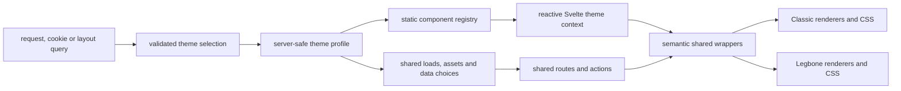

# Theme extension roadmap

This roadmap is part of the current two-layout PR. Classic and Legbone already
share routes, data, permissions and actions; this work makes that boundary
explicit before the PR is merged into `main`. A future layout should be added by
registering a profile, a static shell and the presentation variants it actually
needs, without teaching every route about another theme ID.

The roadmap deliberately stops short of publishing a third layout. A test-only
contract fixture proves that a third registration can resolve without silently
falling back to Legbone or changing a shared route.

The profile, renderer and context migration and focused validation recorded below
are complete. Repository-wide `npm run lint` still fails on unrelated baseline
findings listed under [Completion criteria](#completion-criteria); that merge gate
has not been marked as passing.

## How to use this document

- Check a box only after the implementation and its validation are complete.
- Add the commit, command and evidence to the progress log for every completed
  phase.
- Keep one coherent phase or page family per commit while this PR is open.
- Do not add a capability only for a hypothetical future theme. A capability
  must be used by Classic, Legbone or the contract fixture.
- Keep durable behavior in the owner documents linked from
  [the website contracts](theme-contracts.md).

The complexity checkpoints follow the repository's
[ponytail review skill](../.agents/skills/ponytail-review/SKILL.md). The final
interaction and visual pass follows the
[SlenderAAC UI review skill](../.agents/skills/slenderaac-ui-review/SKILL.md).
Classic composition, UI states and asset delivery remain governed by
[Classic layouts](classic.md), [UI states](ui-states.md) and
[Classic assets](classic-assets.md).

## Why this belongs in the current PR

This PR introduces the second layout and therefore establishes the public
boundary between shared application behavior and theme presentation. Merging
the current direct `classic` branches first would make those branches the
architecture that a later PR must undo. The refactor is a merge gate for this
PR, not an optional cleanup after it.

The initial inventory on the current branch found:

- 57 production files with direct decisions based on `classic`.
- 38 shared or route files with Classic-specific CSS.
- 25 component files, 29 route files, 2 server files and the switcher in the
  direct-decision inventory.

The inventory command is rerun before each migration phase. Asset pack names,
legacy query keys, compatibility aliases, tests and packaging tools are valid
uses of the word `classic` and are tracked separately.

## Target architecture



### Server-safe profile

The single profile map must expose only data that can be imported by server and
browser code:

```ts
type ThemeProfile = {
	label: string;
	assets: {
		chromePack: string | null;
		referencePack: string | null;
		catalogArtworkPack: string | null;
	};
	data: {
		latestNewsLimit: number;
	};
	navigation: {
		preserveSubrouteScroll: boolean;
	};
	presentation: {
		pageSurface: 'ornate' | 'cards';
		contentSource: 'reference' | 'native';
	};
};
```

`ThemeId`, `themeIds`, labels and the default theme are derived from this map.
Asset source references are validated at startup and must point to a registered
theme pack or `null`. `serverLogo` remains a global identity asset shared by
both layouts.

### Static component registry

The client registry combines each profile with static Svelte imports:

```ts
type ThemeDefinition = {
	profile: ThemeProfile;
	components: ThemeComponents;
};

type RegisteredThemeDefinition = ThemeDefinition & {
	id: ThemeId;
	name: string;
};
```

The complete renderer map covers the shell and switcher chrome, page framing,
tables, navigation, modal/radio controls, information/catalog surfaces, news,
authentication, account overview, characters, guilds, highscores and online
players. Reusing another theme's renderer is explicit. Missing renderers never
fall back implicitly to Legbone, and user input never forms an import path.

The root layout publishes the resolved definition through a typed Svelte
context. Shared wrappers keep their public props and slots, while selecting a
registered renderer instead of comparing `$page.data.selectedTheme`.

## Checklist

### Phase 0 — documentation, inventory and baseline

- [x] Count the initial direct-theme decision files.
- [x] Count the initial shared/route Classic CSS files.
- [x] Add this roadmap and link it from the README and theme contracts.
- [x] Record the complete occurrence ledger with owner, category, destination,
      commit and validation.
- [x] Record legitimate asset, alias, debug, compatibility and test exceptions.
- [x] Capture Classic and Legbone representative visual states before moving
      shared markup or CSS.
- [x] Run the ponytail review against the proposed registry and remove any
      unused abstraction.
- [x] Commit the documentation and baseline separately (`63ee9ad`).

### Phase 1 — profile, registry and context

- [x] Add the server-safe profile map and derive theme IDs from it.
- [x] Preserve the Legbone default and invalid-value normalization.
- [x] Attach each current shell to its profile.
- [x] Define the complete `ThemeComponents` contract for current page
      families, including news archive, event schedule and online players.
- [x] Make the registry map complete at TypeScript compile time.
- [x] Add the reactive theme context to the root layout.
- [x] Remove the root-level silent registry fallback.
- [x] Preserve cookies, aliases, canonical URLs and full-document switching.
- [x] Add focused profile, registry, selection and context tests.
- [x] Verify both switch directions with real browser clicks.

### Phase 2 — semantic shared components

- [x] Delegate `PagePanel`, `TableFrame`, `TableSurface` and `SmallPanel` to
      registered renderers.
- [x] Delegate section navigation, modal and radio-choice presentation.
- [x] Delegate information tables, catalog filters and catalog details.
- [x] Keep behavior, slots, labels, focus and keyboard semantics shared.
- [x] Replace theme-ID selectors in shared components with semantic surface
      hooks (`layout-surface-ornate` and `layout-surface-cards`).
- [x] Move remaining renderer-internal CSS under the owning theme directory.
- [x] Validate long labels, scrolling, Escape, focus restoration and mobile
      breakpoints in both layouts.

### Phase 3 — page families

#### News

- [x] Register Latest News, News Archive and Event Schedule renderers.
- [x] Read the article limit and reference source from the profile.
- [x] Preserve tickers, articles, dates, filters, fragments and empty states.
- [x] Validate all three routes in both layouts.

#### Account and authentication

- [x] Register Login and Account Overview renderers.
- [x] Preserve outfits, character status, selection and action visibility.
- [x] Preserve login, verification, 2FA, email and password actions.
- [x] Apply the profile's navigation-scroll policy.
- [x] Validate logged-out, logged-in, verified and pending states.

#### Characters, guilds, highscores and online

- [x] Register character list/profile renderers.
- [x] Register guild list/profile renderers.
- [x] Register highscores and online-player renderers.
- [x] Preserve search, filters, pagination, indicators and empty states.
- [x] Keep all loads, actions, permissions and endpoints shared.

#### Library, community and content

- [x] Remove ID-specific branches from Houses and Worlds.
- [x] Migrate spells, achievements, experience table and world quests.
- [x] Migrate polls, feedback, resellers, fansites and kill statistics.
- [x] Preserve loading, confirmed zero, empty, offline, unavailable, error and
      stale meanings.
- [x] Validate long content and below-the-fold navigation.

### Phase 4 — server and assets

- [x] Load the chrome pack declared by the selected profile.
- [x] Pass reference and catalog artwork sources by profile rather than by
      comparing a concrete theme ID.
- [x] Preserve global server identity and administrator-only asset warnings.
- [x] Preserve neutral missing-pack behavior and external asset boundaries.
- [x] Remove direct theme comparisons from page loads and asset loaders.
- [x] Verify filters, fragments and authentication return URLs.

### Phase 5 — boundary protection

- [x] Add `npm run check:themes` without a new dependency.
- [x] Reject direct selected-theme comparisons with concrete IDs outside the
      theme subsystem.
- [x] Reject imports of Classic/Legbone implementations from routes and shared
      components.
- [x] Reject theme-named CSS selectors outside theme directories.
- [x] Report the exact file, line and rule for every violation.
- [x] Add valid and invalid checker fixtures.
- [x] Include the check in `npm run lint`.
- [x] Keep only documented configuration, asset, alias and test exceptions.

The final shared-code target is:

```text
src/routes/**       0 presentation decisions by concrete theme ID
src/lib/components/**  0 presentation decisions by concrete theme ID
src/routes/**       0 theme implementation imports
src/lib/components/** 0 theme implementation imports
```

### Phase 6 — third-theme contract fixture

- [x] Add a test-only `contract-fixture` profile.
- [x] Give it a complete capability and renderer map.
- [x] Reuse existing renderers only through explicit registration.
- [x] Verify it resolves without a Legbone fallback.
- [x] Verify an incomplete renderer map fails type checking.
- [x] Verify no production route or shared component changes for the fixture.
- [x] Keep it out of the production switcher.
- [x] Document the recipe for a future real theme.
- [x] Run the final ponytail and UI review passes.

### Phase 7 — merge gate

- [x] Update `docs/theme-contracts.md` with the final boundary.
- [x] Add the extension recipe to `docs/themes.md`.
- [x] Update the progress log below after every phase.
- [x] Run the full focused test set and `npm run check:themes`.
- [x] Run `npm run check`; `npm run lint` remains blocked by the documented
      repository baseline findings.
- [x] Run `npm run build` only after all phases are complete.
- [x] Repeat the Classic/Legbone visual matrix.
- [x] Confirm the final shared-code inventory has no unreviewed violations.
- [x] Do not mark this PR merge-ready while a blocking checklist item remains.

## Validation matrix

Use the same viewport, zoom, DPR, scrollbar mode and scroll origin for both
layouts. Cover 1919×945, 1145×945 and a 390px mobile viewport. Check Classic
with and without its external pack and Legbone with short, long and scrolled
menus.

Representative routes:

- `/`, `/news/archive`, `/news/event-schedule`
- `/account/login`, `/account`
- `/characters`, a character profile, `/guilds` and a guild profile
- `/highscores`, `/online`
- Houses list/detail, a guide, a library catalog and a community page

Required interactions include layout switching in both directions, switching
while scrolled, F5 reload, cookie and canonical URL preservation, filters,
fragments, browser history, menu expansion, keyboard focus, modal Escape,
loading/empty/offline/unavailable/error/stale states and animated outfits.

## Progress log

| Date       | Phase                            | Commit    | Validation                                                                                                     | Notes                                                                                                                                                               |
| ---------- | -------------------------------- | --------- | -------------------------------------------------------------------------------------------------------------- | ------------------------------------------------------------------------------------------------------------------------------------------------------------------- |
| 2026-09-14 | Baseline/profile started         | `63ee9ad` | Source inventory and focused inspection                                                                        | Current PR owns the merge gate                                                                                                                                      |
| 2026-09-14 | Semantic renderers               | `b76d55e` | `npm run check`; targeted ESLint                                                                               | Page framing, tables, section navigation, modal and radio presentation now resolve through the registry                                                             |
| 2026-09-14 | Profile-driven server sources    | `012d588` | `npm run check`; `bun test src/lib/themes/profiles.test.ts`; targeted ESLint                                   | News limits, chrome/reference packs, catalog artwork and global logo now use profile capabilities                                                                   |
| 2026-09-14 | Information/catalog renderers    | `10c98f8` | `npm run check`; targeted ESLint                                                                               | Information tables, catalog filters and catalog details keep their public props while moving layout markup and CSS into each theme                                  |
| 2026-09-14 | Capability-based route decisions | `449f1d6` | `npm run check`; targeted ESLint                                                                               | Route and shared-component presentation branches no longer compare `selectedTheme` with a concrete ID; they read profile capabilities                               |
| 2026-09-14 | Page renderer registry           | `7577996` | `npm run check`; targeted ESLint                                                                               | News, login, account, characters, guilds and highscores resolve presentation through static registry entries; asset/news helpers are theme-neutral                  |
| 2026-09-14 | Page family frames               | `4c5ca5c` | `npm run check`                                                                                                | News archive, event schedule and online player families have explicit renderer slots; Classic account overview now lives under the Classic implementation directory |
| 2026-09-14 | Shared surface boundary          | `5c5573d` | `npm run check`; boundary inventory                                                                            | Shared CSS uses semantic surface classes and server reference types no longer import the Classic namespace                                                          |
| 2026-09-14 | Boundary guard and fixture       | `fda7132` | `node --test src/scripts/check-themes.test.mjs`; `npm run check:themes`; `npm run check`                       | The guard reports file, line and rule; a test-only third-theme contract proves complete explicit renderer reuse                                                     |
| 2026-09-14 | Shell and selector registry      | `2c7821b` | `npm run check`; browser switch smoke test                                                                     | Shell and selector presentation are static registry entries; switching remains a full-document navigation                                                           |
| 2026-09-14 | Extension contract documentation | `1f6d44c` | documentation link inspection; `npm run check:themes`                                                          | The registry recipe, server-safe profile boundary and guard command are documented for a future layout                                                              |
| 2026-09-14 | Surface capability fix           | `905d891` | `npm run check`; Classic and Legbone screenshots                                                               | Classic publishes its ornate surface capability at the shell root so shared semantic selectors cannot silently miss it                                              |
| 2026-09-14 | Final route and interaction pass | `89eac21` | `bun test`; `npm run check:themes`; `npm run check`; HTTP smoke matrix (26 routes); CUA switch and screenshots | Both layouts returned 200 for representative page families; browser clicks switched in both directions and rendered distinct shells and content surfaces            |

## Occurrence ledger

The initial inventory was grouped before editing so every occurrence had an
owner and destination. The counts below are the review ledger; the command
used for the final gate is `npm run check:themes`.

| Area                                |                      Baseline | Category                    | Destination                                   | Evidence                                                   |
| ----------------------------------- | ----------------------------: | --------------------------- | --------------------------------------------- | ---------------------------------------------------------- |
| Theme selection and normalization   | 1 selector + 2 server modules | registry/compatibility      | `profiles.ts`, `context.ts`, root layout      | profile tests; `npm run check:themes`                      |
| Shared panels, tables and controls  |         12 component families | structure/interaction       | `ThemeComponents` and `src/lib/themes/<id>/`  | `b76d55e`, `10c98f8`, `npm run check`                      |
| News, account and page families     |          25 components/routes | structure/data presentation | registry renderers and semantic frame classes | `7577996`, `4c5ca5c`, `npm run check`                      |
| Reference and catalog asset choices |              2 server modules | asset/source                | profile asset-pack capabilities               | `012d588`, `5c5573d`                                       |
| Classic CSS selectors               |                      38 files | style                       | semantic surface hooks or theme-owned CSS     | `5c5573d`; zero theme-ID selectors outside theme subsystem |
| Test and compatibility literals     |         remaining literal IDs | compatibility/test          | profiles, aliases, asset endpoints and tests  | documented exceptions below                                |

Legitimate literals remain in the profile/registry, asset pack names,
reference compatibility IDs, debug/query aliases, tests and the theme-owned
implementation directories. They do not select presentation from shared route
or component code and are excluded by the boundary checker only where the
owner subsystem is explicit.

## Completion criteria

The roadmap is complete only when Classic and Legbone preserve their current
behavior, the test-only fixture resolves through the registry, the boundary
check passes, the visual/interaction matrix has evidence, and the focused
checks, `npm run check`, `npm run lint` and final `npm run build` pass. The
repository-wide lint command currently remains an unchecked gate because the
baseline contains unrelated Prettier and ESLint findings outside this change;
the exact files are recorded in the final validation report rather than being
rewritten as part of the theme refactor.

The formatting portion of that baseline gate currently reports these untouched
files: `.agents/skills/ponytail-review/agents/openai.yaml`,
`.agents/skills/slenderaac-ui-review/agents/openai.yaml`,
`src/lib/online-status.test.ts`, `src/lib/server/stripe.ts`,
`src/lib/server/towns.ts`, `src/lib/svelte-codemirror-editor.d.ts`,
`src/routes/(app)/assets-installation-check/+page.svelte`,
`src/routes/(app)/guilds/[name]/+layout.server.ts`,
`src/routes/(app)/guilds/[name]/join/+page.server.ts` and
`src/routes/admin/app.postcss`. The theme boundary check, type check, full test
suite and production build pass independently of those pre-existing findings.
If the formatting gate is bypassed, the repository-wide ESLint scan also
reports unrelated baseline issues in `src/lib/server/email.ts`, the account
verification page, the assets-installation route, guild creation/admin pages,
the two asset installer scripts and `tailwind.config.ts`; those files were not
changed by this roadmap.
